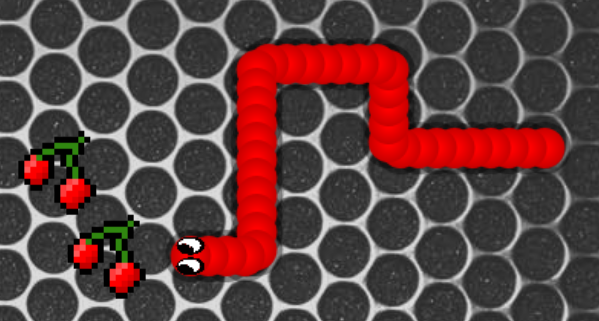
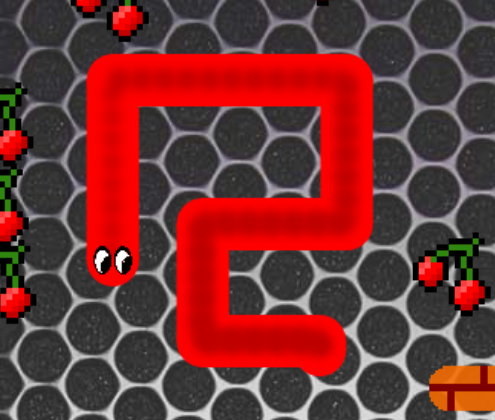

# Snake_JS

-- A snake game for 4 players! Eat cherries and avoid obstacles and other snakes!

-- Made for a gaming table

__Important:__ Don't change highscore_snake.txt! Make sure the application process has rights to write this file!

This application requires the old KIJS framework to run! // Send me a mail for further information :-)

__Modes:__ 
_Normal:_ 1 snake, controlled with arrow keys 
_Table:_ 1 - 4 snakes, controlled with joysticks or button (for more information, please send me a mail) 
_Magic Mode:_ useable in normal and table mode. An automatic snake appeares! Kill it or it kills you!

__Snakes:__ 
_snake.js/magicsnake.js_: A slim snake with circular bodyparts! Nice looking, however gets slower the more it grows. 
 
_snake2.js/magicsnake2.js_: Looks like a moving neon sign. Fatter than his brother but much faster! Way better performance! 

